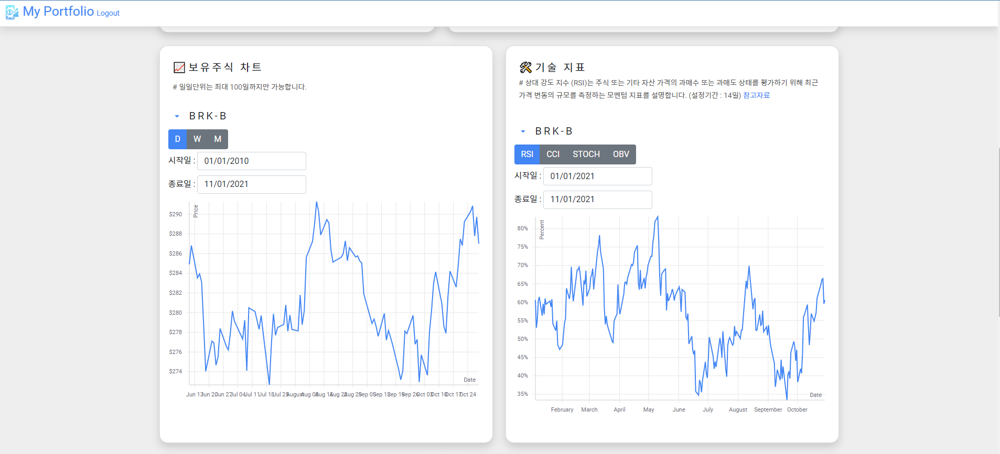

# My Portfolio
> Full-Stack Web Services Project (stock project)

It's my first web project.

## URL
https://my-portfolio.run.goorm.io/

## The Technology Used
React.js, Springboot, Mysql

## Overview
My Portfolio allows you to create your own portfolio and makes it easy to see asset composition and dividend composition.
You can see charts and technical indicators of stocks in the portfolio and check related news.
In addition, you can check the dividend calendar and the amount of dividends you can receive monthly.

## Example

> Portfolio composition and stock balance status
   
  
> Stock charts and technical indicators
   
  
> Dividend calendar and news
   

